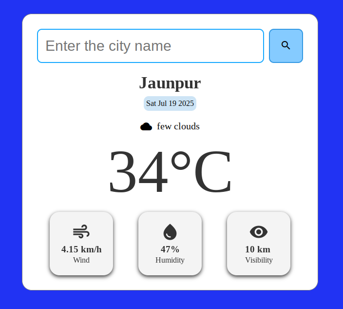

# Weather App

A simple and responsive Weather App built using HTML, CSS, and JavaScript.  
It fetches real-time weather data based on user input or geolocation and displays current temperature, humidity, wind speed, visibility, and weather condition with a clean and user-friendly interface.

---

## ✨ Features

- 🔍 Search weather by city name  
- 🌡️ Displays current temperature and weather condition (e.g., Sunny)  
- 💨 Shows wind speed in KM/H  
- 💧 Shows humidity percentage  
- 👁️ Shows visibility distance in KM  
- 📅 Displays current date  
- 📱 Responsive design suitable for both desktop and mobile devices  
- ⚡ Uses Material Icons for intuitive UI elements

---

## 📸 Screenshots

### 🖥️ Desktop View

---

### 📱 Mobile View

---

## 👨‍💻 Author

**Sonu Yadav**  
📷 [Instagram: @CodeWithSonu](https://www.instagram.com/CodeWithSonu)

---

> Feel free to explore, contribute, and improve this project!
